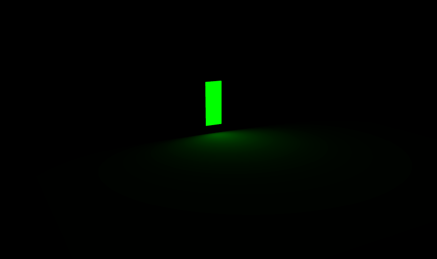

# AreaLight
With AreaLight, we can define a rectangular area that emits light. RectAreaLight emits light uniformly across the face a rectangular plane. This light type can be used to simulate light sources such as bright windows or strip lighting.


#### Constructor
We can create PointLight instance by using this constructor.
```js
RectAreaLight( color : Integer, intensity : Float, width : Float, height : Float )
```

The parameters are:
| Parameter | Is it optional? | Description |
| - | - | - |
| color | ✔️ | Hexadecimal color of the light. Default is 0xffffff (white). |
| intensity | ✔️ | the light's intensity, or brightness. Default is 1. |
| width | ✔️ | width of the light. Default is 10. |
| height | ✔️ | height of the light. Default is 10. |


#### Properties
See the base Light class for common properties.

**.intensity : Float**
The light's intensity. Default is 1.
In physically correct mode, intensity is the luminance (brightness) of the light measured in nits (cd/m^2).

| Intensity | Image |
| - | - |
| 1 |  |
| 10 |  |
| 1000 |  |

Changing the intensity will also change the light's power.

**.power : Float**
The light's power.
In physically correct mode, power is the luminous power of the light measured in lumens (lm).

Changing the power will also change the light's intensity.

#### Methods
See the base Light class for common methods.

**.copy ( source : RectAreaLight ) : RectAreaLight**
Copies value of all the properties from the source to this RectAreaLight.


## RectAreaLightHelper
Creates a visual aid for a RectAreaLight.

Code Example
```js
const light = new THREE.RectAreaLight( 0xffffbb, 1.0, 5, 5 );
const helper = new RectAreaLightHelper( light );
light.add( helper ); // helper must be added as a child of the light
```

#### Constructor
```js
RectAreaLightHelper( light : RectAreaLight, color : Hex )
```

**light** -- The light being visualized.

**color** -- (optional) if this is not the set the helper will take the color of the light.

#### Properties

**.light : RectAreaLight**
Reference to the RectAreaLight being visualized.

**.color : hex**
The color parameter passed in the constructor. Default is undefined. If this is changed, the helper's color will update the next time update is called.

#### Methods
See the base Object3D class for common methods.

**.dispose () : null**
Dispose of the rectAreaLightHelper.

# Example
This part will explain more about the area light example code

1. Add library and helper needed
```js
import * as THREE from './libs/three.module.js';
import { OrbitControls } from './libs/OrbitControls.js';
import { RectAreaLightHelper } from './libs/RectAreaLightHelper.js';
import { RectAreaLightUniformsLib } from './libs/RectAreaLightUniformsLib.js';
```
RectAreaLightUniformsLib dibutuhkan untuk 
OrbitControl dibutuhkan untuk mengubah perspektif camera dari pengguna.

2. Creating renderer, camera, and scene
```js
renderer = new THREE.WebGLRenderer({ antialias: true });
renderer.setPixelRatio(window.devicePixelRatio);
renderer.setSize(window.innerWidth, window.innerHeight);
renderer.setAnimationLoop(animation);
renderer.outputEncoding = THREE.sRGBEncoding;
document.body.appendChild(renderer.domElement);

camera = new THREE.PerspectiveCamera(45, window.innerWidth / window.innerHeight, 1, 1000);
camera.position.set(0, 5, -100);

scene = new THREE.Scene();
```

3. Create AreaLight
```js
const rectLight1 = new THREE.RectAreaLight(0xff0000, 100, 4, 10);
rectLight1.position.set(-20, 7, 5);
scene.add(rectLight1);

const rectLight2 = new THREE.RectAreaLight(0x00ff00, 100, 4, 10);
rectLight2.position.set(0, 7, 5);
scene.add(rectLight2);

const rectLight3 = new THREE.RectAreaLight(0x0000ff, 100, 4, 10);
rectLight3.position.set(20, 7, 5);
scene.add(rectLight3);
```

4. Creating ground floor
```js
const geoFloor = new THREE.BoxGeometry(80, 0.1, 100);
const matStdFloor = new THREE.MeshStandardMaterial({ color: 0x808080, roughness: 0.1, metalness: 0 });
const mshStdFloor = new THREE.Mesh(geoFloor, matStdFloor);
scene.add(mshStdFloor);
```


5. Creating object to emit the lights
```js
scene.add(new RectAreaLightHelper(rectLight1));
scene.add(new RectAreaLightHelper(rectLight2));
scene.add(new RectAreaLightHelper(rectLight3));
```


6 Adding box geometry with rotation
```js
const geomertry = new THREE.BoxGeometry(10, 10, 10, 16);
const material = new THREE.MeshStandardMaterial({ color: 0xffffff, roughness: 0, metalness: 0 });
const cube = new THREE.Mesh(geomertry, material);
cube.name = 'cube';
cube.position.set(0, 5, -20);
scene.add(cube);


function animation(time) {
    const mesh = scene.getObjectByName('cube');
    mesh.rotation.y = time / 1000;
    renderer.render(scene, camera);
}
```


