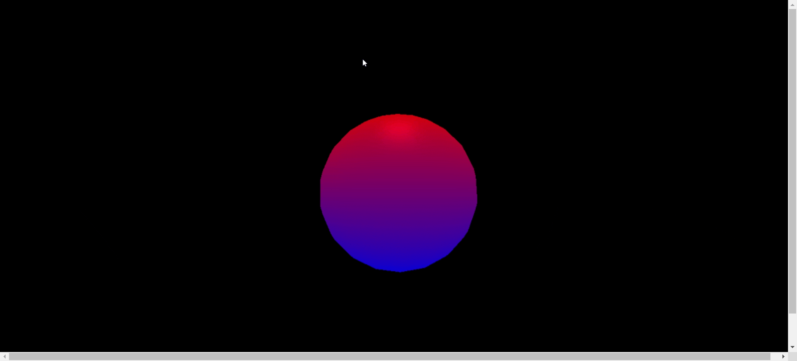

# Hemisphere Light

## Definition

HemisphereLight is a light source positioned directly above the scene, with color fading from the sky color to the ground color. It simulates an area light that illuminates your scene from all directions.


This is useful for creating bounce light effects such as sky lights, or other secondary bounce light effects.

## Defining a Class

We could define a class by using this constructor.
```js
const light = new THREE.HemisphereLight(skyColor, groundColor, intensity);
```

This is what we need to explore more about HemisphereLight.
### Parameters

When using constructor, we could also add some preferences to base project.

|  Parameter  | Data Type | Optional |                           Description                          |
|:-----------:|:---------:|:--------:|:--------------------------------------------------------------:|
|   skyColor  |  Integer  |     ☑️    |       Hexadecimal color of the sky. Default is 0xffffff.       |
| groundColor |  Integer  |     ☑️    |      Hexadecimal color of the ground. Default is 0xffffff.     |
|  intensity  |   Float   |     ☑️    | Numeric value of the light's strength/intensity. Default is 1. |

### Properties

We could use the properties of base [Light](https://threejs.org/docs/#api/en/lights/Light) to set. But, there is also property from HemisphereLight.

| Property    | Data Type | Description                                                                                             |
|-------------|-----------|---------------------------------------------------------------------------------------------------------|
| color       | Float     | The light's sky color, as passed in the constructor. Default is a new Color set to white (0xffffff).    |
| groundColor | Float     | The light's ground color, as passed in the constructor. Default is a new Color set to white (0xffffff). |
| position    | Vector3   | This is set equal to Object3D.DefaultUp (0, 1, 0), so that the light shines from the top down.          |

### Methods

The same also happens for methods, you could also use base Light method. Of course, there is method owned by HemisphereLight.

| Methods                       | Return Type     | Description                                                                               |
|-------------------------------|-----------------|-------------------------------------------------------------------------------------------|
| copy(source: HemisphereLight) | HemisphereLight | Copies the value of color, intensity and groundColor from the source light into this one. |

## Example

In this part, we will learn how to create simple Hemisphere light.
1. Create the standard index.html with ThreeJS. Here, I used CDN as an example.
```html
<head>
    <title>Basic Breakdown of Three.js</title>
    <style>
        body {
            margin: 0;
        }

        canvas {
            width: 100%;
            height: 100%
        }
    </style>
</head>
<body>
<script src="https://cdnjs.cloudflare.com/ajax/libs/three.js/r72/three.min.js"></script>
<script>


</script>
</body>
</html>
```

2. On the `script` tag, add scene, camera, and renderer so that we could modified the view.
```js
var scene = new THREE.Scene();
var camera = new THREE.PerspectiveCamera(75, window.innerWidth / window.innerHeight, 0.1, 1000);
camera.position.z = 5;

var renderer = new THREE.WebGLRenderer();
renderer.setSize(window.innerWidth, window.innerHeight);
document.body.appendChild(renderer.domElement);
```

3. Use Hemisphere light as the ground light of the scene that we will make. Here we make `skyColor` as red and `groundColor` as blue with 1 as intensity.
```js
var light = new THREE.HemisphereLight(0xff0000, 0x0000ff,1);
light.position.set(0,6,0);
scene.add(light);
```

4. Give a geometry.
```js
var geometry = new THREE.SphereGeometry(1.5, 20, 20);
var material = new THREE.MeshPhongMaterial({color: 0xdddddd});
var cube = new THREE.Mesh(geometry, material);
scene.add(cube);
```

5. Lastly, add render function so that we could get our ThreeJS view.
```js
var render = function () {
    requestAnimationFrame(render);

    cube.rotation.x += 0.01;
    cube.rotation.y += 0.01;

    renderer.render(scene, camera);
};

render();
```

We will get this as a result.


### Addition

You could also see what HemisphereLight look like when we change intensity (just copy from `./src`).


### Source
- [HemisphereLight Documentation Three JS](https://threejs.org/docs/#api/en/lights/HemisphereLight)
- Three JS Essential Third Edition by Jos Dirksen
- [HemisphereLight Flamingo by Miranda](https://threejs.org/examples/?q=hemis#webgl_lights_hemisphere)