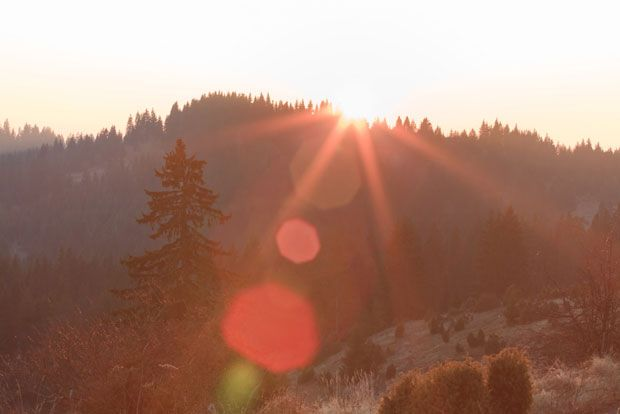
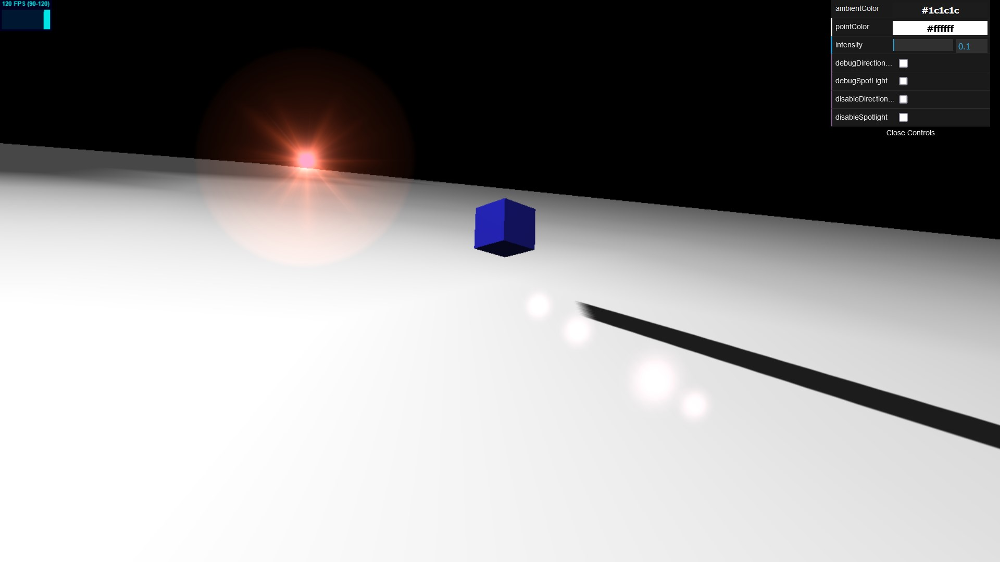
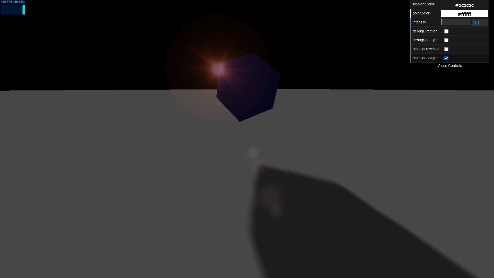
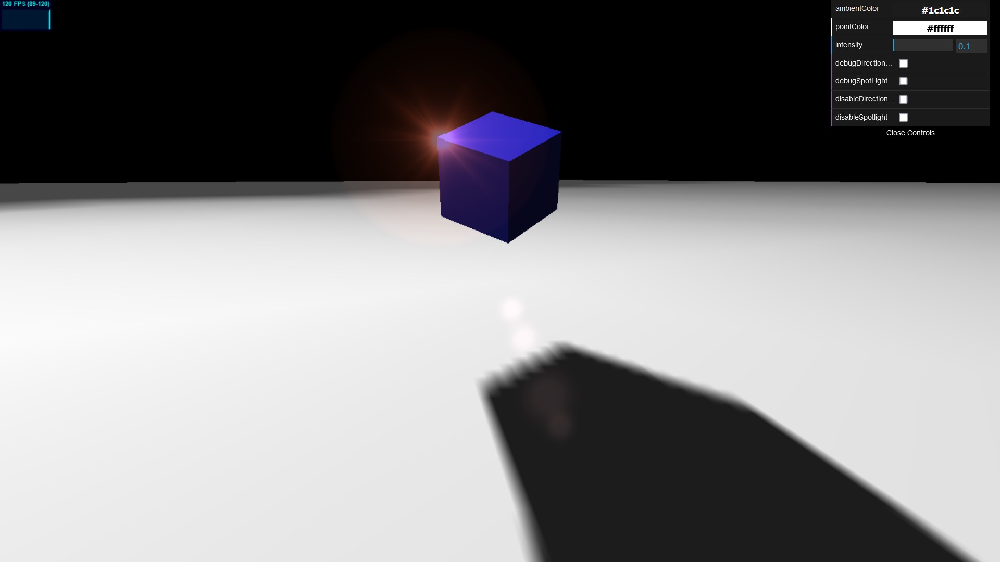
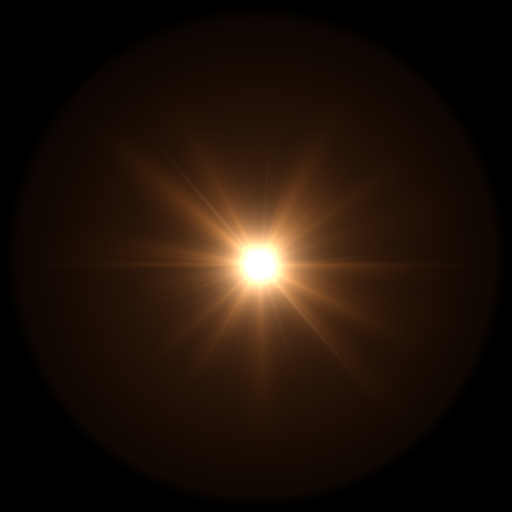
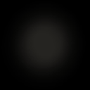

# Lens Flare

## Definition

Lens flare is a photo effect caused when light is scattered in a lens system, often in response to a bright light, such as the sun, a full moon, or artificial illumination.



## Constructor

LensflareElement( `texture` : Texture, `size` : Float, `distance` : Float, `color` : Color )

* `texture` - `THREE.Texture` to use for the flare.
* `size` - (optional) size in pixels
* `distance` - (optional) (0-1) from light source (0 = at light source)
* `color` - (optional) the `Color` of the lens flare

## Example



This part will explain more about the lens flare example code located at `/src/lensflare/js/app.js`. The flow of the code is as such.

1. Create a renderer to render the scene and a camera to see the scene. `trackballControls` is used to allow user to rotate, zoom, and pan around the scene using the mouse.

```js
  var stats = initStats();
  var renderer = initRenderer({
    alpha: true
  });

  var camera = initCamera();
  camera.position.x = -20;
  camera.position.y = 5;
  camera.position.z = 25;
  camera.lookAt(new THREE.Vector3(5, 0, 0));

  var trackballControls = initTrackballControls(camera, renderer);
  var clock = new THREE.Clock();
```

2. Create a scene which will act as a container for camera, lights, and other objects.

```js
  var scene = new THREE.Scene();
```

3. Create a plane object and a cube object. For each object, define the geometry and the material of the object, then group it with `scene` using the `add()` method.

```js
  var planeGeometry = new THREE.PlaneGeometry(1000, 1000, 20, 20);
  var planeMaterial = new THREE.MeshLambertMaterial({
    color: 0xffffff
  });
  var plane = new THREE.Mesh(planeGeometry, planeMaterial);
  plane.receiveShadow = true;

  plane.rotation.x = -0.5 * Math.PI;
  plane.position.x = 0;
  plane.position.y = 0;
  plane.position.z = 0;
  
  scene.add(plane);

  var cubeGeometry = new THREE.BoxGeometry(4, 4, 4);
  var cubeMaterial = new THREE.MeshLambertMaterial({
    color: 0x3333ff
  });
  var cube = new THREE.Mesh(cubeGeometry, cubeMaterial);
  cube.castShadow = true;

  cube.position.x = 0;
  cube.position.y = 5;
  cube.position.z = 0;

  scene.add(cube);
```

4. Add ambient light, spot light, and directional light to the scene. Ambient light is used to add some additional color and soften the shadows. Spot light is used to add more light in the scene. Lastly, directional light will act as the source light.

```js
  var ambiColor = "#1c1c1c";
  var ambientLight = new THREE.AmbientLight(ambiColor);
  scene.add(ambientLight);

  var spotLight = new THREE.SpotLight(0xcccccc);
  spotLight.position.set(-40, 60, -10);
  spotLight.lookAt(plane);
  scene.add(spotLight);

  var spotLightCameraHelper = new THREE.CameraHelper(spotLight.shadow.camera);

  var pointColor = "#ffffff";
  var directionalLight = new THREE.DirectionalLight(pointColor);
  directionalLight.position.set(30, 10, -50);
  directionalLight.castShadow = true;
  directionalLight.shadow.camera.fov = 50;
  directionalLight.target = plane;
  directionalLight.distance = 0;
  directionalLight.shadow.camera.near = 2;
  directionalLight.shadow.camera.far = 200;
  directionalLight.shadow.camera.left = -100;
  directionalLight.shadow.camera.right = 100;
  directionalLight.shadow.camera.top = 100;
  directionalLight.shadow.camera.bottom = -100;
  directionalLight.shadow.mapSize.width = 2048;
  directionalLight.shadow.mapSize.height = 2048;

  scene.add(directionalLight);

  var directionalLightCameraHelper = new THREE.CameraHelper(directionalLight.shadow.camera);
```

### Without Spot Light



### With Spot Light



5. Load the flare textures from the `assets`. Three.js lens flare texture number 0 and 3 will be used. Next, define the flare color with value `0xffaacc` and create a `Lensflare` object (stored in `lensFlare`). After that, add `LensflareElement` objects to `lensFlare` to register the flares. Finally, add `lensFlare` to `directionalLight`.

```js
  var textureFlare0 = THREE.ImageUtils.loadTexture("../../assets/textures/flares/lensflare0.png");
  var textureFlare3 = THREE.ImageUtils.loadTexture("../../assets/textures/flares/lensflare3.png");

  var flareColor = new THREE.Color(0xffaacc);

  var lensFlare = new THREE.Lensflare();

  lensFlare.addElement(new THREE.LensflareElement(textureFlare0, 350, 0.0, flareColor));
  lensFlare.addElement(new THREE.LensflareElement(textureFlare3, 60, 0.6, flareColor));
  lensFlare.addElement(new THREE.LensflareElement(textureFlare3, 70, 0.7, flareColor));
  lensFlare.addElement(new THREE.LensflareElement(textureFlare3, 120, 0.9, flareColor));
  lensFlare.addElement(new THREE.LensflareElement(textureFlare3, 70, 1.0, flareColor));

  directionalLight.add(lensFlare);
```

### textureFlare0



### textureFlare3



6. Use the `render()` function to update the rotation of the cube and to render the scene.

```js
  render();

  function render() {
    stats.update();
    trackballControls.update(clock.getDelta());
    
    cube.rotation.x += controls.rotationSpeed;
    cube.rotation.y += controls.rotationSpeed;
    cube.rotation.z += controls.rotationSpeed;

    requestAnimationFrame(render);
    renderer.render(scene, camera);
  }
```

## Reference

1. Dirksen, J. (2018). Learn Three.js (3rd ed.). Packt.
2. https://en.wikipedia.org/wiki/Lens_flare
3. https://threejs.org/docs/#examples/en/objects/Lensflare
4. https://www.imaginated.com/glossary/what-is-lens-flare/